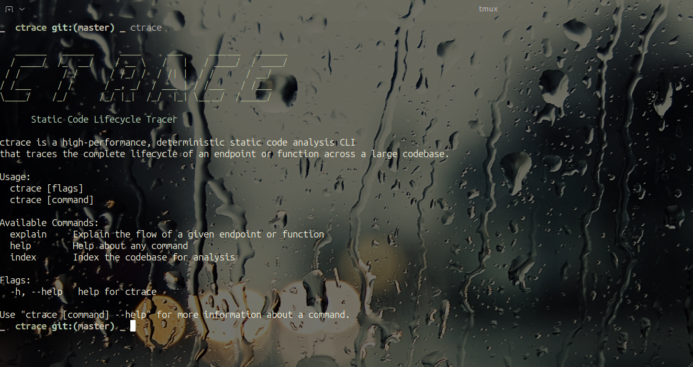
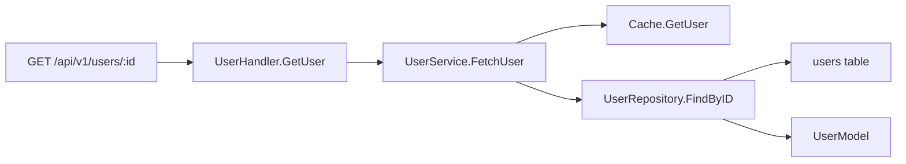
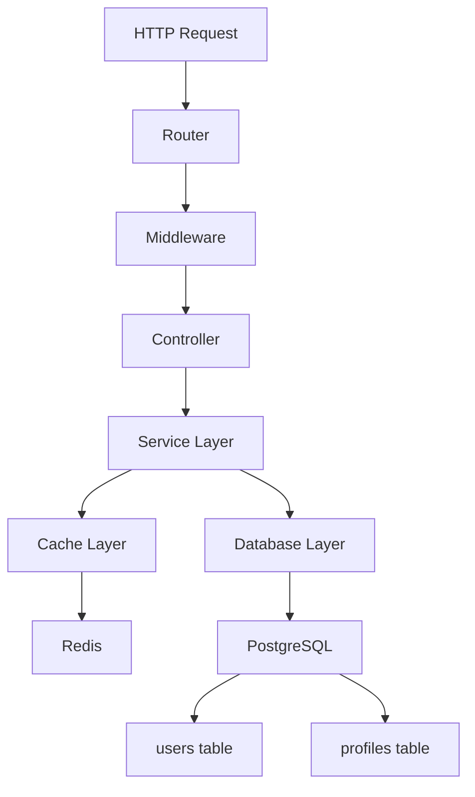

# ctrace — Static Code Lifecycle Tracer



> **Fast, deterministic static code analysis CLI that traces the complete lifecycle of an endpoint or function across large codebases**

[](https://golang.org/dl/)
[](LICENSE)
[](https://github.com/your-org/ctrace/actions)

## 🚀 Quick Start

```bash
# Install ctrace
go install github.com/your-org/ctrace@latest

# Trace an endpoint lifecycle
ctrace explain GET /api/v1/users/:id

# Trace a specific function
ctrace explain handlers/user.go GetUser
```

## 📖 What is ctrace?

Modern production codebases suffer from **deep call stacks**, **heavy abstractions**, and **implicit data access** that make understanding code flow slow and error-prone. Developers spend **5-10 minutes** manually tracing endpoints through:

- IDE "Go to Definition" navigation
- Manual searching across files
- Partial call hierarchies
- AI tools that may hallucinate paths

**ctrace eliminates this friction** by providing a fast, deterministic, static view of endpoint lifecycles in large codebases.

## 🎯 Core Features

### ✅ **Deterministic Analysis**
- Pure static analysis - no code execution required
- No AI hallucination or probabilistic logic
- Source-of-truth results derived directly from AST inspection

### ⚡ **Lightning Fast**
- **1-3 seconds** even for 50k-100k LOC repositories
- Parallel file parsing and incremental caching
- Scoped traversal (only analyzes reachable code)

### 🔍 **Complete Lifecycle Tracing**
- Entry point definition location
- Direct and indirect function calls
- Control flow across utilities and services
- Data models, interfaces, and database schemas involved

### 🌐 **Language Agnostic**
- Built on **tree-sitter** for high-performance parsing
- Plugin-like adapter model for easy language support
- Currently supports: Go, TypeScript/JavaScript, Python, Java, C#, Rust

## 🏗️ Architecture Overview

```mermaid
graph TD
    A[Source Repository] --> B[File Scanner]
    B --> C[AST Parser<br/>(tree-sitter)]
    C --> D[Symbol Indexer]
    D --> E[Call Graph Core]
    E --> F[Data Lineage<br/>Extractor]
    F --> G[Flow Sorter]
    G --> H[Output Renderer]
    
    H --> I[Plain Text]
    H --> J[Markdown]
    H --> K[JSON]
    H --> L[Mermaid Diagrams]
```

## 📊 Performance Benchmarks

| Repository Size | Expected Runtime |
|----------------|------------------|
| 10k LOC | < 300ms |
| 50k LOC | ~1s |
| 100k LOC | ~2-3s |

*Performance assumes cached ASTs and scoped traversal*

## 🛠️ Installation

### Option 1: Go Install (Recommended)
```bash
go install github.com/your-org/ctrace@latest
```

### Option 2: Download Binary
```bash
# Download the latest release for your platform
curl -L https://github.com/your-org/ctrace/releases/latest/download/ctrace-linux-amd64.tar.gz | tar xz
sudo mv ctrace /usr/local/bin/
```

### Option 3: Build from Source
```bash
git clone https://github.com/your-org/ctrace.git
cd ctrace
go build -o ctrace ./cmd/ctrace
sudo mv ctrace /usr/local/bin/
```

## 📝 Usage Examples

### Basic Endpoint Tracing
```bash
ctrace explain GET /api/v1/users/:id
```

**Output:**
```
Endpoint: GET /api/v1/users/:id

1. routes/user.go:42
   → UserHandler.GetUser()

2. handlers/user.go:18
   → UserService.FetchUser()

3. services/user.go:33
   → Cache.GetUser()
   → UserRepository.FindByID()

4. repositories/user.go:51
   → users table
   → UserModel
```

### Function Tracing
```bash
ctrace explain handlers/user.go GetUser
```

**Output:**
```
Function: GetUser in handlers/user.go:18

1. handlers/user.go:18
   → UserService.FetchUser()

2. services/user.go:33
   → Cache.GetUser()
   → UserRepository.FindByID()

3. repositories/user.go:51
   → users table
   → UserModel
```

### Export Formats

#### JSON Output
```bash
ctrace explain GET /api/v1/users/:id --output json
```

#### Markdown Output
```bash
ctrace explain GET /api/v1/users/:id --output markdown > trace.md
```

#### Mermaid Diagram
```bash
ctrace explain GET /api/v1/users/:id --output mermaid > flow.mmd
```

## 🎨 Visual Examples

### Call Flow Visualization


### Complex Flow with Multiple Paths


## 🔧 Configuration

Create a `.ctrace.yaml` configuration file in your project root:

```yaml
# .ctrace.yaml
languages:
  go:
    enabled: true
    include_tests: false
  typescript:
    enabled: true
    include_tests: true

output:
  format: "text"  # text, json, markdown, mermaid
  color: true
  verbose: false

analysis:
  max_depth: 10
  parallel_parsing: true
  cache_enabled: true
```

## 📋 Supported Languages

| Language | Status | Framework Support |
|----------|--------|-------------------|
| Go | ✅ Complete | Gin, Echo, net/http |
| TypeScript/JavaScript | ✅ Complete | Express, Fastify, NestJS |
| Python | 🚧 Beta | Django, Flask, FastAPI |
| Java | 🚧 Beta | Spring Boot, JAX-RS |
| C# | 🚧 Beta | ASP.NET Core |
| Rust | 🚧 Beta | Actix, Warp, Rocket |

## 🎯 Use Cases

### 🔍 **Code Reviews & Audits**
Quickly understand the impact of changes by tracing function lifecycles before approval.

### 👨‍💻 **Onboarding & Documentation**
Help new team members understand complex codebases faster.

### 🔧 **Refactoring & Migration**
Identify all dependencies and call paths before making breaking changes.

### 🚨 **Incident Investigation**
Trace request flows to identify potential failure points during outages.

### 📊 **Architecture Analysis**
Visualize code dependencies and identify architectural patterns.

## 🤝 Contributing

We welcome contributions! Please see our [Contributing Guide](CONTRIBUTING.md) for details.

### Adding Language Support
1. Create a new adapter in `internal/adapters/`
2. Implement the `LanguageAdapter` interface
3. Register the adapter in `internal/parser/parser.go`
4. Add tests in `internal/adapters/<language>/test/`

### Development Setup
```bash
# Clone the repository
git clone https://github.com/your-org/ctrace.git
cd ctrace

# Run tests
go test ./...

# Run with debug logging
CTRACE_LOG_LEVEL=debug go run ./cmd/ctrace explain example.go MyFunction
```

## 📚 API Reference

### CLI Commands

#### `ctrace explain`
Trace the lifecycle of an endpoint or function.

**Usage:**
```bash
ctrace explain [ENTRY_POINT] [OPTIONS]
```

**Options:**
- `--output, -o`: Output format (text, json, markdown, mermaid)
- `--depth, -d`: Maximum traversal depth
- `--verbose, -v`: Enable verbose logging
- `--config, -c`: Custom config file path

#### `ctrace version`
Show version information.

#### `ctrace help`
Show help information.

### Programmatic API

```go
import "github.com/your-org/ctrace"

// Create a new tracer
tracer := ctrace.NewTracer()

// Configure options
tracer.SetMaxDepth(10)
tracer.EnableParallelParsing(true)

// Trace an endpoint
result, err := tracer.TraceEndpoint("GET /api/v1/users/:id")
if err != nil {
    log.Fatal(err)
}

// Print results
fmt.Println(result.String())
```

## 🐛 Reporting Issues

If you encounter any bugs or have feature requests, please [open an issue](https://github.com/your-org/ctrace/issues) on GitHub.

## 📄 License

This project is licensed under the MIT License - see the [LICENSE](LICENSE) file for details.

## 🙏 Acknowledgments

- Built on [tree-sitter](https://tree-sitter.github.io/tree-sitter/) for fast, incremental parsing
- Inspired by the need for deterministic static analysis tools in large codebases
- Special thanks to the Go community for excellent CLI and concurrency libraries

---

**Made with ❤️ for developers who love clean, fast, and reliable code analysis**

[](https://github.com/your-org/ctrace)
[](https://twitter.com/yourhandle)